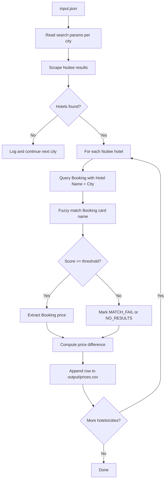

# Hotel Price Scraper (Nuitee vs Booking.com)

This repository compares hotel prices between Nuitee and Booking.com for a list of cities and dates.
It is built for reliable batch scraping with Playwright, supports Docker and local runs, and writes a single CSV output that is easy to review or process downstream.

## What This Script Does

For each search item in input.json, the scraper does the following:

1. Opens Nuitee and searches by city, dates, and room/adult configuration.
2. Collects all available hotels from Nuitee with their MAD prices.
3. For every hotel found on Nuitee, opens Booking.com with an enriched query: Hotel Name + City.
4. Applies fuzzy name matching to avoid wrong hotel cards.
5. Extracts the Booking price when the match is valid.
6. Saves one row per hotel into output/prices.csv.

The output is useful for:

- price gap analysis between Nuitee and Booking
- identifying missing/failed matches
- building QA pipelines for inventory and parity checks

## How It Works (Flow)



## Runtime Steps In Detail

### 1. Input Loading

- The script reads input.json from the repository root.
- It loops city-by-city.
- Each city can define either:
   - adults and rooms, or
   - rooms_config (example: [2,1,3] means 3 rooms with 2/1/3 adults).

### 2. Nuitee Collection

- Opens Nuitee in an isolated browser context.
- Sets destination, check-in/check-out, and guest distribution.
- Waits for hotel results.
- Uses a scrolling harvest strategy for virtualized result lists.
- Keeps unique hotel names only.

### 3. Booking Validation + Price Extraction

- Runs hotel lookups with bounded concurrency.
- Builds Booking search URL with dates, room count, adults, and MAD currency.
- Dismisses popups/modals automatically.
- Forces Booking internal search resolution.
- Picks the best card among top results with fuzzy matching.
- Returns status:
   - OK: valid name match and price extracted
   - NO_RESULTS: hotel/page available but price not extractable or no availability
   - MATCH_FAIL: best visible card does not match threshold
   - ERROR: runtime exception

### 4. CSV Output

- Appends rows incrementally into output/prices.csv.
- Includes hotel identity, trip info, both prices, difference, match status, and final Booking URL.

## Project Structure

```text
.
├── src/
│   ├── main.py                # Main scraper and CSV writer
│   └── verify_and_correct.py  # Post-run verifier/fixer for weak rows
├── input.json                 # Batch input (cities + dates)
├── output/                    # Generated CSV files
├── requirements.txt
├── Dockerfile
├── docker-compose.yml
├── Makefile
└── Readme.md
```

## Quick Start

### Option A: Run with Docker (recommended)

1. Create .env in the project root.
2. Add at least NUITEE_URL.
3. Build and run:

```bash
make build
make run
```

Or keep it running in background:

```bash
make start
```

Output file:

- output/prices.csv

### Option B: Run locally

Requirements:

- Python 3.10+
- Linux packages required by Playwright

Steps:

```bash
python3 -m venv .venv
source .venv/bin/activate
pip install -r requirements.txt
playwright install chromium
python3 src/main.py
```

## Input Format

input.json is an array. Each object is one city search job.

```json
[
   {
      "city": "Paris",
      "checkin": "2026-08-01",
      "checkout": "2026-08-02",
      "adults": 2
   },
   {
      "city": "Madrid",
      "checkin": "2026-08-01",
      "checkout": "2026-08-02",
      "rooms_config": [2, 1]
   }
]
```

Field notes:

- city: destination text
- checkin / checkout: YYYY-MM-DD
- adults: used when rooms_config is not provided
- rooms: optional; defaults to 1 when rooms_config is not provided
- rooms_config: optional explicit room distribution; overrides adults/rooms logic

## Environment Variables

Create a .env file in repo root.

Required:

```dotenv
NUITEE_URL="https://your-nuitee-instance.link/"
```

Common optional tuning:

```dotenv
FUZZY_THRESHOLD=85
BOOKING_CONCURRENCY=4
MAX_SCROLL_PASSES=180
MAX_SCROLL_SECONDS=120

# used by verify_and_correct.py
VERIFY_CONCURRENCY=5
CHECKPOINT_EVERY=50
```

## Output Schema

Main output file: output/prices.csv

Columns:

1. Hotel Name
2. City
3. Check-in
4. Check-out
5. Adults per Room
6. Rooms
7. Nuitee Price (MAD)
8. Booking Price (MAD)
9. Price Difference (MAD)
10. match_status
11. Booking URL

Difference formula currently used in main.py:

- Price Difference (MAD) = Booking Price - Nuitee Price

## Verification Script (Recommended After Main Run)

verify_and_correct.py is a second pass tool for quality control.

It re-checks rows that are likely bad (missing price, MATCH_FAIL, NO_RESULTS, ERROR, unverified rows), retries extraction, and writes a corrected output CSV.

Example:

```bash
python3 src/verify_and_correct.py \
   --input output/prices.csv \
   --output output/prices_verified.csv \
   --concurrency 5
```

Useful flags:

- --force-all: re-verify every row
- --fuzzy-threshold: override matching threshold

## Makefile Commands

- make build: build docker image
- make run: run foreground container once
- make start: run detached and tail logs
- make stop: stop container
- make logs: stream scraper logs
- make shell: open interactive bash in container
- make clean: remove containers and clear output files
- make nuke: clean + remove local image layers

## Troubleshooting

- Empty or low results on Nuitee:
   - confirm NUITEE_URL is reachable from container/host
   - reduce concurrency and retry
- Many MATCH_FAIL statuses:
   - lower FUZZY_THRESHOLD slightly (example: 80)
   - run verify_and_correct.py to improve final quality
- Playwright issues in local mode:
   - run playwright install chromium
   - if system deps are missing, prefer Docker mode
- Input errors:
   - validate date format and city spelling in input.json

## Notes For Developers

- The main scraper currently reads input.json from project root directly.
- docker-compose passes --input input.json, but main.py does not parse CLI args yet.
- CSV rows are appended during runtime, so partial progress is preserved if a city fails.

If you plan to extend this repo, good next refactors are:

- add argparse support to main.py
- split main.py into smaller modules (Nuitee, Booking, writer)
- add schema validation for input.json before scraping starts
